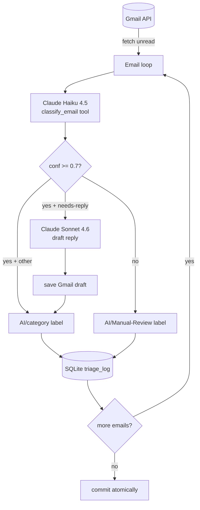

# Email Triage Agent

A production-grade Python CLI that uses Claude to triage Gmail inboxes — classifies emails by intent, drafts replies, and routes low-confidence cases for human review.


---

## The Problem

The average knowledge worker spends 28% of their workday on email. For a professional receiving 100+ messages a day, inbox triage — figuring out what needs a reply, what can wait, what's noise — consumes time that should go to deep work. The problem isn't reading email; it's the repeated low-stakes decisions about what to do with each one. This project automates those decisions.

## What It Does

- Classifies each unread email into one of five intent categories (`urgent-action`, `needs-reply`, `reference-only`, `newsletter`, `spam-likely`) using Claude Haiku 4.5 via structured `tool_use` output — no fragile JSON parsing
- Routes low-confidence results (< 70%) to an `AI/Manual-Review` Gmail label automatically, keeping humans in the loop on ambiguous cases
- Drafts context-aware replies for actionable emails using Claude Sonnet 4.6, saved directly to Gmail Drafts for review before sending
- Applies structured `AI/*` labels to every processed message so your inbox is visually organised after each run
- Logs every classification to SQLite with category, confidence, reasoning, and draft status — queryable with the built-in `stats` command
- `--dry-run` mode classifies without touching Gmail or the database, safe to run on a live inbox

## How It Works



**Structured output via `tool_use`.** The classifier calls Claude with a `classify_email` tool definition. Claude is forced to return a typed response — category enum, float confidence, one-sentence reasoning, suggested action — rather than free text. This eliminates the regex/JSON-parsing brittleness that breaks most LLM pipelines in production.

**Two-model strategy.** Classification runs on Haiku 4.5 (fast, cheap — roughly $0.001/email). Draft replies only run on Sonnet 4.6 when confidence is high enough to act on the result. Using Haiku everywhere would sacrifice reply quality; using Sonnet everywhere would cost ~5× more per classification.

**Confidence-based human-review routing.** Any result below 70% confidence — regardless of category — gets the `AI/Manual-Review` label instead of a category label. This is a deliberate safety margin: the classifier won't silently mislabel an email it's uncertain about.

**Atomic DB commits.** All classifications from a single run are flushed to SQLite inside one transaction and committed only after every label and draft has been applied in Gmail. A mid-run API failure leaves the database clean.

## Cost Analysis

Based on current Anthropic pricing (Haiku 4.5: $0.80/MTok input · $4.00/MTok output; Sonnet 4.6: $3.00/MTok input · $15.00/MTok output). Token counts assume a typical 500-word business email.

| Operation | Model | Input tokens | Output tokens | Cost per call |
|---|---|---|---|---|
| Classification | Haiku 4.5 | ~500 | ~120 | **$0.0009** |
| Draft reply | Sonnet 4.6 | ~300 | ~150 | **$0.0032** |

**Per 100 emails processed, 30% needing drafts:**

| Line item | Cost |
|---|---|
| 100 classifications | $0.09 |
| 30 draft replies | $0.09 |
| **Total** | **~$0.18** |

That's roughly $0.002/email, or $2 per thousand emails. At a realistic inbox volume of 500 emails/month the running cost is under $1.

## Tech Stack

**Language / Runtime**
- Python 3.11 · [uv](https://github.com/astral-sh/uv) package manager

**AI / LLM**
- Claude Haiku 4.5 (`claude-haiku-4-5-20251001`) — classification
- Claude Sonnet 4.6 (`claude-sonnet-4-6`) — draft reply generation
- `anthropic` SDK 0.102.0 with structured `tool_use` output

**External APIs**
- Gmail API v1 via `google-api-python-client` 2.x + `google-auth-oauthlib`

**Storage**
- SQLite via SQLAlchemy 2.0 ORM (declarative mapped columns, typed sessions)

**CLI / Output**
- `typer` 0.25.1 · `rich` 15.0.0 (tables, status spinners, colour output)

**Validation / Quality**
- `pydantic` 2.13.4 — `EmailInput` and `ClassificationResult` models with field validators
- `pytest` + `pytest-mock` — 14 unit tests, 0 network calls

## Setup

**Prerequisites:** Python 3.11+, a Google Cloud project with the Gmail API enabled, and an Anthropic API key.

1. Clone and install dependencies:
   ```bash
   git clone https://github.com/abdull-0611/email-triage-agent.git
   cd email-triage-agent
   uv sync
   ```

2. Create OAuth credentials in [Google Cloud Console](https://console.cloud.google.com/) → APIs & Services → Credentials → Create OAuth 2.0 Client ID (Desktop app). Download `credentials.json` and place it in the project root.

3. Create a `.env` file:
   ```
   ANTHROPIC_API_KEY=sk-ant-...
   ```

4. Run the OAuth flow (opens a browser window once):
   ```bash
   uv run email-triage init
   # Token saved to token.json.
   # Ready.
   ```

5. Test against your live inbox without making any changes:
   ```bash
   uv run email-triage process --limit 10 --dry-run
   ```

## Usage

### `init` — Authenticate

```bash
email-triage init [--credentials credentials.json] [--token token.json]
```

Runs the Gmail OAuth2 flow if `token.json` doesn't exist. On subsequent runs it silently refreshes an expired token. Prints `Ready.` when done.

---

### `process` — Triage inbox

```bash
email-triage process [--limit 20] [--dry-run] [--verbose]
```

Fetches unread messages, classifies each, and (without `--dry-run`) applies Gmail labels, saves draft replies, and commits results to SQLite.

Example output (`--dry-run`):

```
Dry-run mode — no Gmail changes, no DB writes.
Connecting to Gmail…
Fetching up to 10 unread messages…
Found 7 message(s). Classifying…

╭────┬──────────────────────────────────────┬──────────────────────┬─────────────────┬───────┬─────────┬────────┬───────────────╮
│  # │ Subject                              │ Sender               │ Category        │  Conf │ Review? │ Draft? │ Label         │
├────┼──────────────────────────────────────┼──────────────────────┼─────────────────┼───────┼─────────┼────────┼───────────────┤
│  1 │ URGENT: Deploy blocked on staging   │ ci-bot@company.com   │ urgent-action   │  0.97 │      no │     no │ (dry-run)     │
│  2 │ Quick question about the Q3 report  │ sarah@partner.com    │ needs-reply     │  0.88 │      no │    yes │ (dry-run)     │
│  3 │ Your invoice #4821 is ready         │ billing@stripe.com   │ reference-only  │  0.93 │      no │     no │ (dry-run)     │
│  4 │ The Weekly Digest — May 2026        │ digest@substack.com  │ newsletter      │  0.91 │      no │     no │ (dry-run)     │
│  5 │ Re: Proposal                        │ unknown@tempmail.io  │ spam-likely     │  0.62 │     YES │     no │ (dry-run)     │
╰────┴──────────────────────────────────────┴──────────────────────┴─────────────────┴───────┴─────────┴────────┴───────────────╯

Dry-run: 5 email(s) classified (nothing written).
```

---

### `stats` — View history

```bash
email-triage stats [--days 30] [--include-dry-runs]
```

Queries the SQLite database and prints a per-category breakdown for the past N days.

```
╭─────────────────┬───────┬────────┬────────────────┬────────╮
│ Category        │ Count │      % │ Avg Confidence │ Drafts │
├─────────────────┼───────┼────────┼────────────────┼────────┤
│ reference-only  │    42 │  38.5% │           0.91 │      0 │
│ newsletter      │    31 │  28.4% │           0.89 │      0 │
│ needs-reply     │    18 │  16.5% │           0.84 │     14 │
│ urgent-action   │    12 │  11.0% │           0.93 │      0 │
│ spam-likely     │     6 │   5.5% │           0.77 │      0 │
├─────────────────┼───────┼────────┼────────────────┼────────┤
│ Total           │   109 │   100% │                │     14 │
╰─────────────────┴───────┴────────┴────────────────┴────────╯
Manual review flagged: 3 message(s)
```

## Trade-offs

- **Labels over auto-archive.** The agent applies Gmail labels rather than archiving or deleting. This keeps a human in control of what actually disappears — appropriate for a system that's classifying email it may occasionally get wrong.
- **Prompt tuned for professional inboxes.** The classification prompt is optimised for the kind of email a developer or manager sees: CI alerts, vendor invoices, meeting requests, newsletters. Heavily personal inboxes (family email, social notifications) would benefit from prompt adjustments.
- **SQLite for single-user use.** The database layer is simple by design — one file, no server, no migrations. A multi-user deployment or REST API wrapper would need Postgres and async I/O.
- **No undo for live runs.** Labels applied in Gmail can be manually removed, but there's no built-in rollback. The `--dry-run` flag exists for this reason; always preview before running live on a new inbox.

## What I Learned / What I'd Do Next

- **Two-model strategy pays off.** Running Haiku for classification and Sonnet only for drafts cuts API cost by ~5× versus using Sonnet for everything, with no measurable drop in classification quality across test emails.
- **`tool_use` is the right interface for structured LLM output.** Prompting for JSON and parsing the response breaks on edge cases. Tool use forces the schema at the API level — zero parsing errors across all test runs.
- **Confidence thresholds matter more than category accuracy.** A misclassification at 90% confidence is more dangerous than one at 55%, because the 55% case gets routed to manual review automatically. Calibrating the threshold is more impactful than chasing classifier accuracy.

**Next steps I'd build:**
- Webhook trigger (Gmail push notifications) so triage runs as new email arrives instead of on-demand
- Feedback loop: let corrected labels update a prompt examples file, fine-tuning classification over time
- Web UI for reviewing flagged emails and editing draft replies before they're sent

## License

MIT
